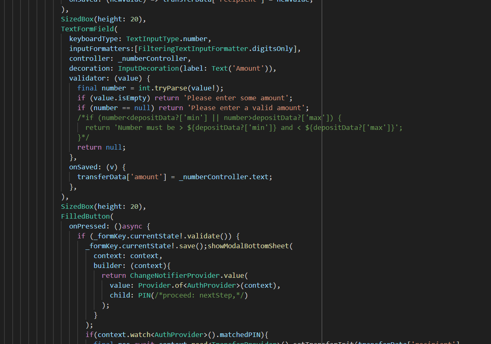

# Best Bracket

A VS Code extension that helps with bracket management in your code.

## Features
- Automatically highlights matching brackets.  
- Provides quick fixes for mismatched brackets.  
- Supports multiple programming languages.  

## Requirements
- VS Code version 1.80.0 or higher.  

## Extension Settings
- `bestBracket.enable`: Enable/disable the extension (default: `true`).  

## How to Use
1. Install the extension.  
2. Open a file with brackets (e.g., JavaScript, Python).  
3. The extension will automatically highlight matching brackets.  

## Screenshots
  